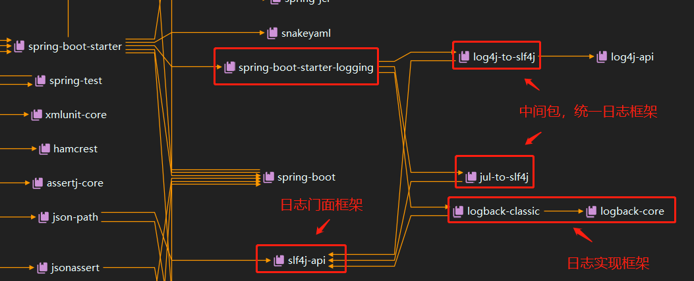

# SpringBoot

## 三、日志

### 1、日志框架

| 日志门面 | 日志实现               |
| -------- | ---------------------- |
| sl4j     | logback，log4j，log4j2 |

### 2、SL4J使用

#### 1、在系统中使用sl4j

> 官网：http://www.slf4j.org/

sl4j对不同日志框架的支持：

1. 实现了sl4j-api的日志类，直接支持
2. 未实现了sl4j-api的日志类，通过适配层，向上实现sl4j-api，向下调用日志实现类。例如，log4j。


使用：

1. 导入sl4j和日志实现框架（以及适配器，如需）
2. 实际开发时调用sl4j的接口，实现接口的是低层具体的日志实现框架
3. 日志配置文件仍使用日志实现框架的配置文件

```java
import org.slf4j.Logger;
import org.slf4j.LoggerFactory;

public class HelloWorld {
  public static void main(String[] args) {
    Logger logger = LoggerFactory.getLogger(HelloWorld.class);
    logger.info("Hello World");
  }
}
```


#### 2、日志统一问题

问题：

我们自己的系统中使用的日志系统是sl4j+logback，但是系统依赖的库使用的是其他日志系统（比如依赖Spring，Spring使用的是commons-logging）,如何让系统所有的日志都统一到sl4j？


解决方法：

1. ==排除系统中的其他日志框架==
2. ==用slf4j中间换皮包替换原有的日志框架==
3. ==导入sl4j-api和其他的实现==


底层原理：

1. 系统中依赖原有日志框架时，可以到中间换皮包中找到依赖的类（sl4j中间换皮包具有原有日志框架相同的包名和类名）
2. 中间换皮包统一调用sl4j-api
3. sl4j-api调用具体的日志实现框架


### 3、SpringBoot日志关系

**SpringBoot使用的是sl4j+logback记录日志，引入其他库时，只需要把原有日志框架擦除掉就可以了。**




### 4、日志使用

#### 1、默认配置

**日志输出级别**

SpringBoot使用sl4j框架，sl4j的日志输出级别从低到高：trace<debug<info<warn<error。

logging.level

```yaml
logging:
  level:
    root: trace
```

**日志输出位置**

| logging.file.name              | logging.file.path           | 解析                                 |
| :----------------------------- | :-------------------------- | ------------------------------------ |
| 无                             | 无                          | 只在控制台打印                       |
| mylogging.log                  | 无                          | 项目目录下输出到mylogging.log        |
| mylogging.log                  | 绝对路径：/opt/data/wwwlog/ | 输出到/opt/data/wwwlog/mylogging.log |
| mylogging.log                  | 相对路径：./                | 项目目录下输出到mylogging.log        |
| 无                             | 绝对路径：/opt/data/wwwlog/ | 输出到/opt/data/wwwlog/spring.log    |
| 无                             | 相对路径：./                | 项目目录下输出到spring.log           |
| /opt/data/wwwlog/mylogging.log | ./                          | logging.file.name覆盖path的设置      |

总结：

1. 都不指定，不会输出到文件
2. 文件默认输出位置是项目当前目录
3. 文件名默认是spring.log
4. logging.file.name是路径+文件名的时候，覆盖path的设置

**日志输出格式**

logback输出格式：http://logback.qos.ch/manual/layouts.html


**参考配置**

```properties
# 日志输出级别
logging.level.root=debug

# 日志输出文件名
logging.file.name=mylogging.log
# 日志输出目录
logging.file.path=/opt/data/wwwlog/

# 控制台日志输出格式
# 时间 [ 级别 ] [ 线程ID ] --- [ 行号 ] [ 全类名 ] 信息
logging.pattern.console=%d{yyyy-MM-dd HH:mm:ss} [ %level ] [ %t ] --- [ %L ] [ %-20C ] %m %n
# 日志文件输出格式
logging.pattern.file=%d{yyyy-MM-dd HH:mm:ss} [ %level ] [ %t ] --- [ %L ] [ %-20C ] %m %n
```

#### 2、指定配置

**SpringBoot**